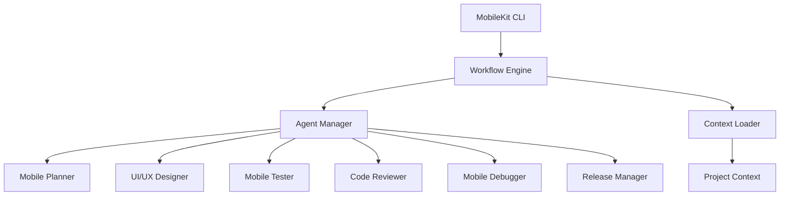
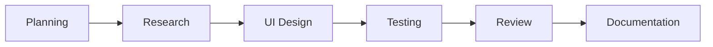
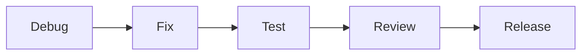

# 🚀 MobileKit - AI-Powered Mobile Development Toolkit

> Transform your mobile development workflow with AI agents that handle everything from planning to deployment.

[](https://github.com/your-org/mobilekit)
[](LICENSE)
[](https://github.com/your-org/mobilekit)

## 🎯 Overview

MobileKit is an AI-powered toolkit that brings intelligent automation to mobile development. With 12 specialized AI agents, it handles your entire development lifecycle - from initial planning to app store deployment.

### ✨ Key Features

- 🤖 **12 Specialized AI Agents** - Each agent handles specific aspects of mobile development
- 🔄 **Intelligent Workflows** - Sequential, parallel, and fan-out execution patterns
- 📱 **Mobile-First Focus** - Optimized for Flutter, iOS Swift, and React Native
- 🎨 **UI/UX Generation** - AI-powered design and code generation
- 🧪 **Comprehensive Testing** - Automated testing across devices and platforms
- 🚀 **Release Automation** - Streamlined app store deployment
- 📊 **Progress Tracking** - Real-time workflow monitoring and reporting

## 🏗️ Architecture



## 🚀 Quick Start

### Installation
```bash
pip install mobilekit
mk init
mk configure --ai-provider openai --api-key your-api-key
```

### Create Your First Project
```bash
mk new-project --type flutter --name MyApp --platforms ios android
cd MyApp
mk generate-feature --name user-profile --type screen
```

### Run Tests and Deploy
```bash
mk run-tests --coverage
mk build-release --platform both --target app-store
```

## 🤖 AI Agents

| Agent | Role | Specialization |
|-------|------|----------------|
| 📋 **Mobile Planner** | Architecture & Planning | Technical requirements, implementation strategy |
| 🔍 **Mobile Researcher** | Research & Analysis | Package research, best practices, comparisons |
| 🎨 **UI/UX Designer** | Design & Assets | Mockups, code generation, asset creation |
| 🗄️ **Database Architect** | Data Management | Schema design, offline strategies, migrations |
| 🧪 **Mobile Tester** | Quality Assurance | Test generation, device compatibility, automation |
| 👁️ **Code Reviewer** | Code Quality | Security, performance, mobile best practices |
| 🐛 **Mobile Debugger** | Debugging & Fixes | Crash analysis, performance optimization |
| 📚 **Docs Manager** | Documentation | API docs, user guides, auto-updates |
| 🌿 **Git Manager** | Version Control | Branch management, CI/CD, mobile workflows |
| 🚀 **Release Manager** | Deployment | App store submissions, TestFlight, compliance |
| ✍️ **Content Writer** | Content & Marketing | Store descriptions, release notes, localization |
| 📊 **Project Tracker** | Project Management | Progress tracking, milestones, coordination |

## 🔄 Workflow Examples

### New Feature Development


### Bug Fix & Release


## 📱 Platform Support

### Flutter
- ✅ Cross-platform development
- ✅ Widget generation
- ✅ Material Design compliance
- ✅ Platform-specific optimizations

### iOS Swift
- ✅ Native iOS development
- ✅ SwiftUI code generation
- ✅ Human Interface Guidelines
- ✅ App Store optimization

### React Native
- ✅ JavaScript/TypeScript support
- ✅ Native module integration
- ✅ Platform-specific customization
- ✅ Performance optimization

## 📊 Demo Application

We've created a comprehensive web application that demonstrates MobileKit's capabilities:

**[🔗 View Live Demo](https://ppl-ai-code-interpreter-files.s3.amazonaws.com/web/direct-files/640c0797ac038d6cf4542eb5bea6041e/857651a4-6530-4d2f-b1ce-30468eb9a2b0/index.html)**

Features:
- 📊 Agent management dashboard
- 🔄 Visual workflow builder
- 🚀 Project initialization wizard
- 💻 Command center interface
- 📖 Comprehensive documentation

## 📁 Project Structure

```
mobile-kit/
├── agents/                    # AI agent definitions
├── workflows/                 # Workflow configurations  
├── templates/                 # Project templates
├── commands/                  # CLI command implementations
├── orchestrator/              # Workflow engine
├── cli/                       # Command-line interface
└── docs/                      # Documentation
```

## 🛠️ Development Files

| File | Description | Purpose |
|------|-------------|---------|
| [`mobile-kit-structure.md`](mobile-kit-structure.md) | Complete project structure and agent roles | Architecture overview |
| [`mobile-ui-ux-designer-agent.md`](mobile-ui-ux-designer-agent.md) | Detailed agent definition example | Agent implementation guide |
| [`new-feature-workflow.yaml`](new-feature-workflow.yaml) | Complete workflow configuration | Workflow design pattern |
| [`mk_cli.py`](mk_cli.py) | Full CLI implementation | Command-line interface |
| [`orchestrator_engine.py`](orchestrator_engine.py) | Workflow orchestration engine | Core execution engine |
| [`MOBILE_CONTEXT_template.md`](MOBILE_CONTEXT_template.md) | Project context template | Project configuration |
| [`SETUP_GUIDE.md`](SETUP_GUIDE.md) | Installation and setup guide | Getting started |

## 🎯 Use Cases

### 🏢 Enterprise Development
- Large-scale mobile applications
- Cross-platform consistency
- Automated quality assurance
- Compliance and security

### 🚀 Startup MVP
- Rapid prototyping
- Resource optimization
- Quick market validation
- Scalable architecture

### 👥 Team Collaboration
- Standardized workflows
- Knowledge sharing
- Consistent code quality
- Automated documentation

### 🔄 DevOps Integration
- CI/CD automation
- Release management
- Quality gates
- Performance monitoring

## 🔧 Configuration

### Global Settings
```yaml
# ~/.mobilekit/config.yaml
ai_provider: "openai"
model: "gpt-4"
project_type: "flutter"
target_platforms: ["ios", "android"]
```

### Project Context
```markdown
# MOBILE_CONTEXT.md
- Project-specific configuration
- Tech stack definitions
- Platform guidelines
- Quality standards
```

## 🧪 Testing Strategy

- **Unit Tests**: Business logic validation
- **Widget Tests**: UI component testing
- **Integration Tests**: End-to-end scenarios
- **Device Testing**: Real device validation
- **Performance Tests**: Memory and battery optimization

## 🚀 Release Management

- **Automated Builds**: CI/CD integration
- **Code Signing**: Certificate management
- **Store Submission**: App Store & Play Store
- **Staged Rollouts**: Risk mitigation
- **Rollback Capabilities**: Quick recovery

## 📈 Benefits

### 🕒 Time Savings
- **80% faster development** from planning to deployment
- **Automated testing** across multiple devices
- **Instant code reviews** with mobile expertise

### 🎯 Quality Improvement  
- **Consistent architecture** across projects
- **Mobile-specific optimizations** built-in
- **Security best practices** enforced

### 🧠 Knowledge Amplification
- **AI-powered insights** for mobile development
- **Best practice recommendations** 
- **Platform-specific guidance**

### 📊 Scalability
- **Team coordination** through standardized workflows
- **Project handovers** with comprehensive documentation
- **Maintainable codebases** with clear architecture

## 🤝 Contributing

We welcome contributions! Please see our [Contributing Guide](CONTRIBUTING.md) for details.

1. Fork the repository
2. Create a feature branch
3. Make your changes
4. Add tests and documentation
5. Submit a pull request

## 📄 License

This project is licensed under the MIT License - see the [LICENSE](LICENSE) file for details.

## 🆘 Support

- 📖 **Documentation**: [MobileKit Docs](https://mobilekit.dev/docs)
- 💬 **Community**: [Discord Server](https://discord.gg/mobilekit) 
- 🐛 **Issues**: [GitHub Issues](https://github.com/your-org/mobilekit/issues)
- ✉️ **Email**: support@mobilekit.dev

## 🙏 Acknowledgments

- Inspired by [ClaudeKit.cc](https://claudekit.cc/) for AI-powered development workflows
- Built for the mobile development community
- Powered by state-of-the-art AI models

---

**Ready to revolutionize your mobile development workflow?** 

[🚀 Get Started](SETUP_GUIDE.md) | [📖 Documentation](https://mobilekit.dev/docs) | [💬 Join Community](https://discord.gg/mobilekit)
