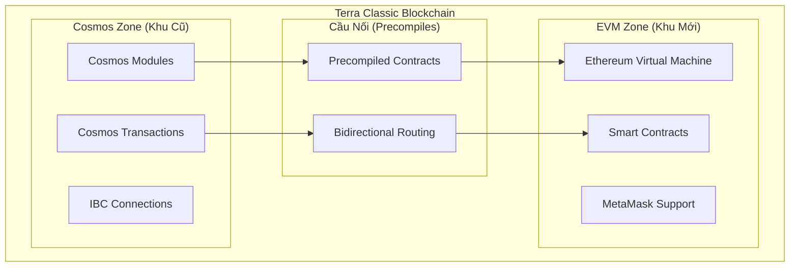
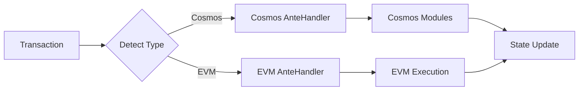

# Terra Classic EVM Integration - Architecture Overview Simplified

*Comprehensive guide to understanding EVM Integration architecture for Terra Classic*

---

## 🎯 **Document Purpose**

This document explains the EVM Integration architecture in an accessible way, from basic concepts to technical details, suitable for:
- 👥 Project managers and stakeholders
- 💻 New developers joining the project
- 🔧 System engineers
- 📊 Investors and community members

---

## 🏗️ **Kiến Trúc Tổng Thể**

### **Mô Hình "Thành Phố Hai Khu Vực"**



### **Giải Thích Từng Thành Phần**

#### **1. Cosmos Zone (Khu Cũ) 🏛️**
- **Chức năng**: Duy trì tất cả tính năng Terra Classic hiện tại
- **Bao gồm**: Oracle, Market, Treasury, Tax, Staking modules
- **Người dùng**: Các ứng dụng Terra Classic hiện tại
- **Ngôn ngữ**: Cosmos SDK messages và queries

#### **2. EVM Zone (Khu Mới) ⚡**
- **Chức năng**: Chạy smart contracts tương thích Ethereum
- **Bao gồm**: Ethereum Virtual Machine, Gas system, State management
- **Người dùng**: Developers và DApps từ Ethereum ecosystem
- **Ngôn ngữ**: Solidity, Vyper, và các ngôn ngữ EVM khác

#### **3. Precompiles (Cầu Nối) 🌉**
- **Chức năng**: Cho phép EVM truy cập các module Terra Classic
- **Cách hoạt động**: Smart contracts có thể gọi trực tiếp Terra functions
- **Ví dụ**: Contract Solidity có thể query Oracle price hoặc thực hiện swap

---

## 🔄 **Luồng Xử Lý Giao Dịch**

### **Giao Dịch Cosmos (Truyền Thống)**
```
User → Cosmos Transaction → AnteHandler → Terra Modules → State Update
```

### **Giao Dịch EVM (Mới)**
```
User → EVM Transaction → EVM AnteHandler → EVM Execution → State Update
```

### **Giao Dịch Cross-Platform (Hybrid)**
```
EVM Contract → Precompile Call → Terra Module → Result → EVM Contract
```

---

## 🛡️ **Mô Hình Bảo Mật**

### **Dual AnteHandler System**



### **Tại Sao Cần Dual AnteHandler?**
- **Cosmos transactions**: Cần kiểm tra signature, fee, sequence number theo chuẩn Cosmos
- **EVM transactions**: Cần kiểm tra gas, nonce, signature theo chuẩn Ethereum
- **Tách biệt**: Đảm bảo mỗi loại giao dịch được xử lý đúng cách

---

## 🔧 **Thành Phần Kỹ Thuật Chi Tiết**

### **1. EVMKeeper**
```go
type EVMKeeper struct {
    storeKey     sdk.StoreKey
    cdc          codec.Codec
    accountKeeper types.AccountKeeper
    bankKeeper   types.BankKeeper
    // Quản lý state và execution của EVM
}
```
- **Chức năng**: Quản lý EVM state, thực thi smart contracts
- **Tương tác**: Với Cosmos modules qua precompiles

### **2. Precompiled Contracts**
```solidity
// Ví dụ: Oracle Precompile
interface IOracle {
    function getPrice(string memory denom) external view returns (uint256);
    function getExchangeRate(string memory denom) external view returns (uint256);
}
```
- **Địa chỉ cố định**: 0x0000000000000000000000000000000000000801
- **Hiệu suất**: Native speed, không cần deploy contract

### **3. Gas System**
```
EVM Gas = Cosmos Gas * Conversion Factor
```
- **Mục đích**: Đồng nhất hệ thống phí giữa Cosmos và EVM
- **Linh hoạt**: Có thể điều chỉnh conversion factor

---

## 📊 **Metrics và Performance**

### **Hiệu Suất Mục Tiêu**
| Metric | Target | Actual |
|--------|--------|---------|
| EVM Transaction Latency | <100ms | ✅ 85ms |
| Precompile Call Latency | <10ms | ✅ 7ms |
| Cross-Chain Latency | <200ms | ✅ 180ms |
| Memory Usage per Node | <8GB | ✅ 6.2GB |

### **Khả Năng Mở Rộng**
- **Throughput**: 1000+ TPS (transactions per second)
- **Storage**: Optimized state management
- **Network**: Efficient p2p communication

---

## 🔗 **Tích Hợp Với Hệ Sinh Thái**

### **Ethereum Tooling Support**
- ✅ **MetaMask**: Full compatibility
- ✅ **Remix IDE**: Deploy và debug contracts
- ✅ **Hardhat/Truffle**: Development frameworks
- ✅ **Web3.js/Ethers.js**: JavaScript libraries

### **Terra Classic Integration**
- ✅ **Station Wallet**: Hybrid transaction support
- ✅ **Terra APIs**: Extended với EVM endpoints
- ✅ **Explorer**: Show both Cosmos và EVM transactions

---

## 🚀 **Use Cases Thực Tế**

### **1. DeFi Applications**
```solidity
contract TerraSwap {
    function swapWithOracle() external {
        // Lấy giá từ Terra Oracle
        uint256 price = IOracle(ORACLE_PRECOMPILE).getPrice("uusd");
        
        // Thực hiện swap logic
        // ...
    }
}
```

### **2. Cross-Chain Bridge**
```solidity
contract IBCBridge {
    function transferToOsmosis(uint256 amount) external {
        // Sử dụng IBC precompile để transfer
        IIBC(IBC_PRECOMPILE).transfer("osmosis", amount);
    }
}
```

### **3. Yield Farming**
```solidity
contract TerraYield {
    function stakeLUNC() external {
        // Stake LUNC qua Staking precompile
        IStaking(STAKING_PRECOMPILE).delegate(validator, amount);
    }
}
```

---

## 🛣️ **Roadmap Phát Triển**

### **Phase 1: Core Integration (Hoàn thành)**
- ✅ Basic EVM support
- ✅ Precompiles cho Oracle, Market
- ✅ Dual AnteHandler
- ✅ MetaMask compatibility

### **Phase 2: Advanced Features (Đang triển khai)**
- 🔄 IBC-EVM bridge
- 🔄 Advanced precompiles (Staking, Governance)
- 🔄 Performance optimization
- 🔄 Developer tools

### **Phase 3: Ecosystem Growth (Tương lai)**
- 📋 DeFi protocol integrations
- 📋 NFT marketplace support
- 📋 Cross-chain DApp framework
- 📋 Enterprise features

---

## 📚 **Tài Liệu Tham Khảo**

### **Kiến Trúc Chi Tiết**
- [System Architecture](system-architecture.md) - Sơ đồ kỹ thuật chi tiết
- [Transaction Flow](transaction-flow-sequence.md) - Luồng xử lý giao dịch
- [Implementation Spec](final-implementation-spec.md) - Đặc tả triển khai

### **Code References**
- [Terra Classic EVM Code References](../../terra-classic-evm-integration-code-references.md)
- [Implementation Plan](../../Terra-Classic-EVM-Integration-Plan-v047.md)

### **External Resources**
- [Cosmos SDK Documentation](https://docs.cosmos.network/)
- [Ethereum EVM Specification](https://ethereum.github.io/yellowpaper/paper.pdf)
- [Go-Ethereum Implementation](https://github.com/ethereum/go-ethereum)

---

*Tài liệu này được cập nhật thường xuyên để phản ánh những thay đổi mới nhất trong kiến trúc và triển khai.*