# Terra Classic (LUNC) - So Sánh Trước và Sau Khi Tích Hợp EVM

## Tổng Quan
Document này cung cấp so sánh chi tiết về kiến trúc và tính năng của Terra Classic trước và sau khi tích hợp EVM module.

## 1. Kiến Trúc Hệ Thống - So Sánh Tổng Thể

### Tóm tắt kiến trúc (bảng so sánh nhanh):

| Thành phần                | Trước (Cosmos SDK)         | Sau (Cosmos SDK + EVM)         |
|--------------------------|----------------------------|---------------------------------|
| Application Layer        | Terra Station, CLI         | + MetaMask, Web3 DApps         |
| API                      | LCD API                    | + JSON-RPC Server              |
| Smart Contract           | CosmWasm                   | + EVM (Solidity)               |
| Module                   | Auth, Bank, Staking, ...   | + EVM, Fee Market, ERC20       |
| Consensus                | Tendermint                 | Tendermint (Dual AnteHandler)   |
| Storage                  | IAVL, LevelDB              | + EVM State, Precompiles        |
### So Sánh Kiến Trúc Chi Tiết

#### TRƯỚC: Terra Classic Original

```mermaid
flowchart TD
    subgraph BEFORE["🔵 TRƯỚC: Terra Classic Original"]
        subgraph AppLayer["Application Layer"]
            A1[Terra Station] 
            A3[CLI Tools]
            A2[Terra Classic API]
        end
        subgraph CosmosSDK["Cosmos SDK v0.46"]
            B1[Auth Module]
            B2[Bank Module] 
            B3[Staking Module]
            B4[Gov Module]
            B5[Oracle Module]
            B6[Market Module]
            B7[Treasury Module]
            B8[Wasm Module]
        end
        subgraph Consensus["Consensus & Networking"]
            C1[Tendermint Core]
            C2[P2P Network]
            C3[ABCI Interface]
        end
        subgraph Storage["Storage"]
            D1[IAVL Tree]
            D2[LevelDB]
        end
        
        A1 --> A2
        A3 --> A2
        A2 --> B1
        B1 --> B2
        B2 --> B3
        B3 --> B4
        B4 --> B5
        B5 --> B6
        B6 --> B7
        B7 --> B8
        B8 --> C1
        C1 --> C2
        C2 --> C3
        C3 --> D1
        D1 --> D2
    end
```

#### SAU: Terra Classic với EVM

```mermaid
flowchart TD
    subgraph AFTER["🟢 SAU: Terra Classic with EVM"]
        subgraph AppLayer2["Application Layer Enhanced"]
            E1[Terra Station]
            E3[🆕 MetaMask]
            E5[🆕 Web3 DApps]
            E6[CLI Tools]
            E2[Terra Classic API]
            E4[🆕 JSON-RPC Server]
        end
        subgraph CosmosSDK2["Cosmos SDK v0.47 + EVM"]
            F1[Auth Module]
            F2[Bank Module]
            F3[Staking Module]
            F4[Gov Module]
            F5[Oracle Module]
            F6[Market Module]
            F7[Treasury Module]
            F8[Wasm Module]
            F9[🆕 EVM Module]
            F10[🆕 Fee Market]
            F11[🆕 ERC20 Module]
        end
        subgraph EVMRuntime["🆕 EVM Runtime"]
            G1[Go-Ethereum VM]
            G2[StateDB]
            G3[🆕 Precompiles]
            G4[🆕 EVM Keeper]
        end
        subgraph Consensus2["Enhanced Consensus"]
            H1[Tendermint Core]
            H2[P2P Network]
            H3[🆕 EVM AnteHandler]
            H4[ABCI Interface]
        end
        subgraph Storage2["Hybrid Storage"]
            I1[IAVL Tree]
            I2[🆕 EVM State]
            I3[LevelDB]
        end
        
        E1 --> E2
        E3 --> E4
        E5 --> E4
        E6 --> E2
        E2 --> F1
        E4 --> F9
        F1 --> F2
        F2 --> F3
        F3 --> F4
        F4 --> F5
        F5 --> F6
        F6 --> F7
        F7 --> F8
        F8 --> F9
        F9 --> F10
        F10 --> F11
        F11 --> G1
        G1 --> G2
        G2 --> G3
        G3 --> G4
        G4 --> H1
        H1 --> H2
        H2 --> H3
        H3 --> H4
        H4 --> I1
        I1 --> I2
        I2 --> I3
    end
    
    %% Styles for new components
    style F9 fill:#4CAF50,stroke:#2E7D32,color:#fff
    style F10 fill:#4CAF50,stroke:#2E7D32,color:#fff
    style F11 fill:#4CAF50,stroke:#2E7D32,color:#fff
    style G1 fill:#FF9800,stroke:#F57C00,color:#fff
    style G2 fill:#FF9800,stroke:#F57C00,color:#fff
    style G3 fill:#FF9800,stroke:#F57C00,color:#fff
    style G4 fill:#FF9800,stroke:#F57C00,color:#fff
    style H3 fill:#2196F3,stroke:#1976D2,color:#fff
    style I2 fill:#9C27B0,stroke:#7B1FA2,color:#fff
    style E3 fill:#FFC107,stroke:#FF8F00,color:#000
    style E4 fill:#FFC107,stroke:#FF8F00,color:#000
    style E5 fill:#FFC107,stroke:#FF8F00,color:#000
```

## 2. Luồng Giao Dịch - Trước và Sau

### Luồng Giao Dịch: Trước và Sau Khi Tích Hợp EVM

#### 1. TRƯỚC: Chỉ Cosmos SDK Transactions

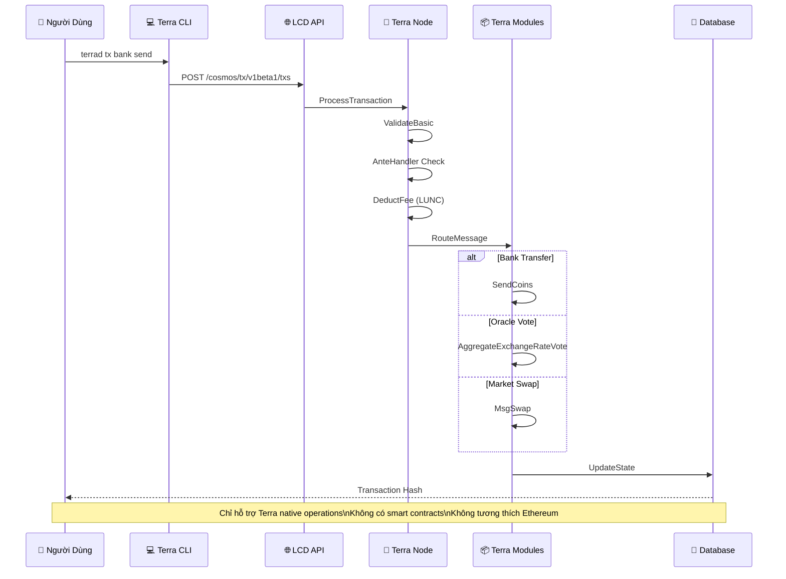

---

#### 2. SAU: Hybrid Cosmos + EVM Transactions

##### a. EVM Transaction Flow (MỚI)

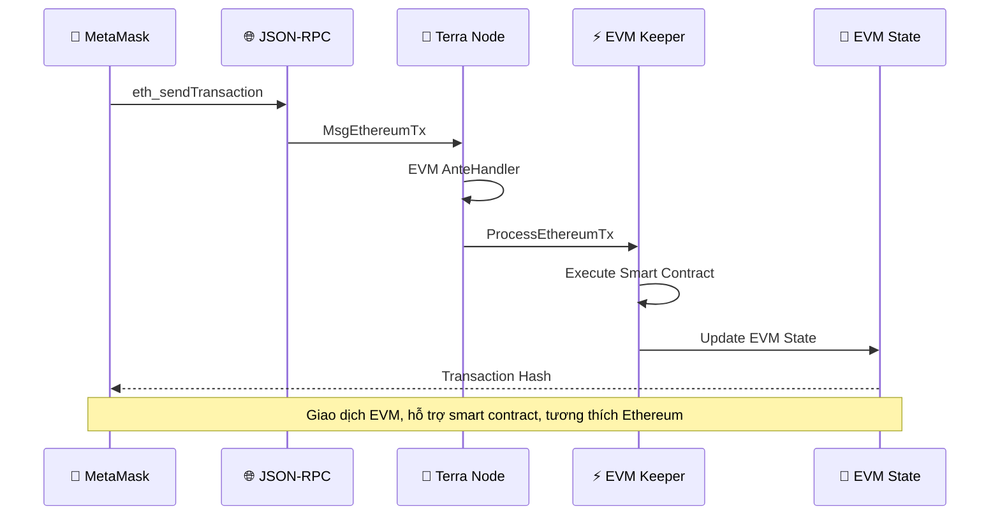

##### b. Cosmos Transaction Flow (CŨ + CẢI TIẾN)

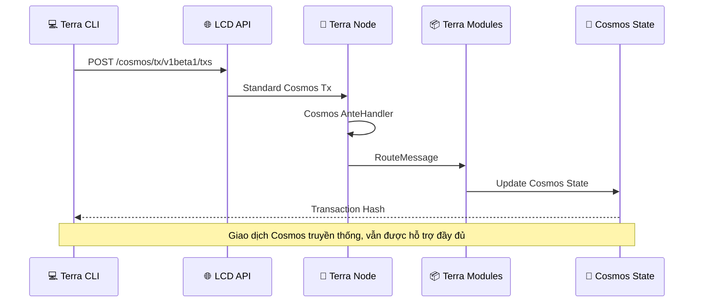

##### c. Cross-Chain Interaction (MỚI)

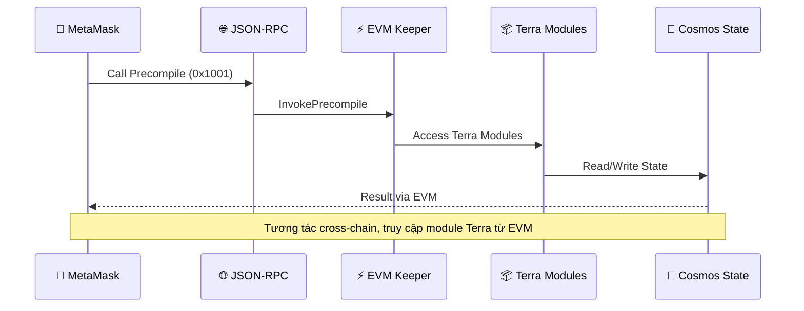

## 3. So Sánh Tính Năng Chi Tiết

#### 3.1 Khả Năng Giao Dịch

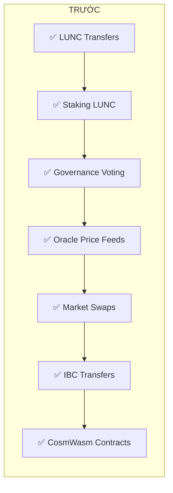

#### 3.1 Khả Năng Giao Dịch (SAU)

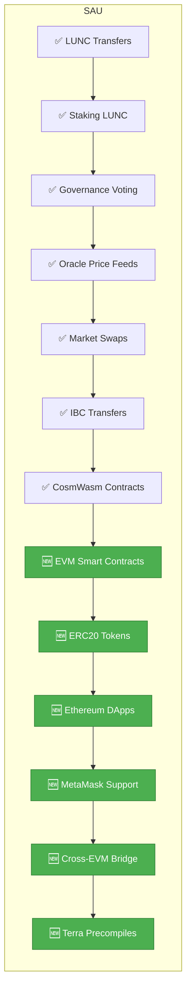

#### 3.2 Wallet Support (TRƯỚC)

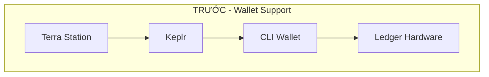

#### 3.2 Wallet Support (SAU)

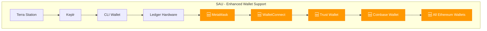

## 4. Developer Experience Comparison

### 4.1 Trước: Terra Classic Development

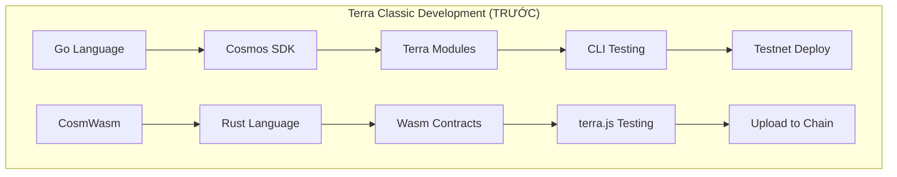

### 4.2 Sau: Enhanced Development

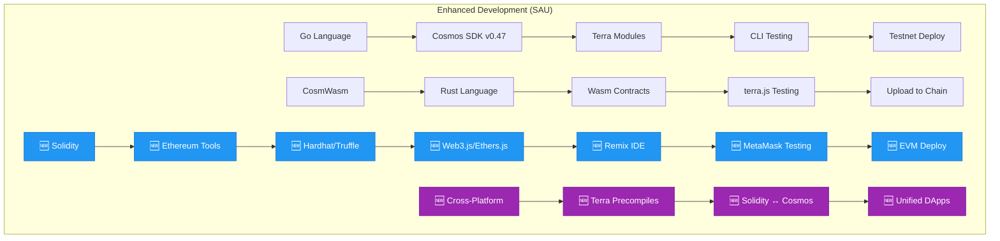

## 5. So Sánh Hiệu Suất và Chi Phí

### 5.1 Gas Fees Comparison

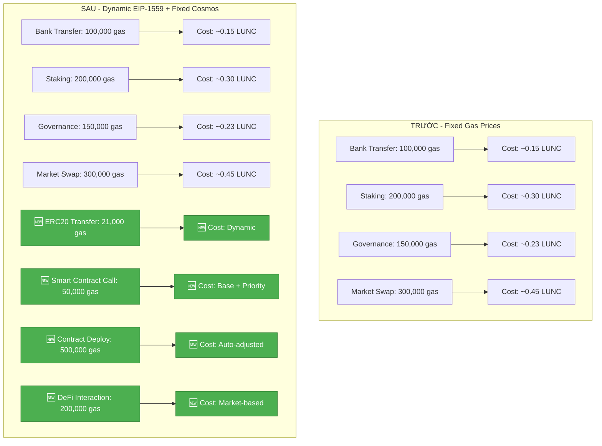

## 6. Ecosystem Integration

### 6.1 Trước: Limited Ecosystem

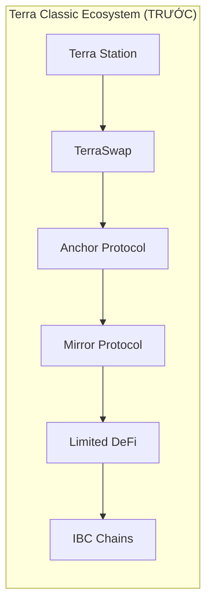

### 6.2 Sau: Expanded Ecosystem

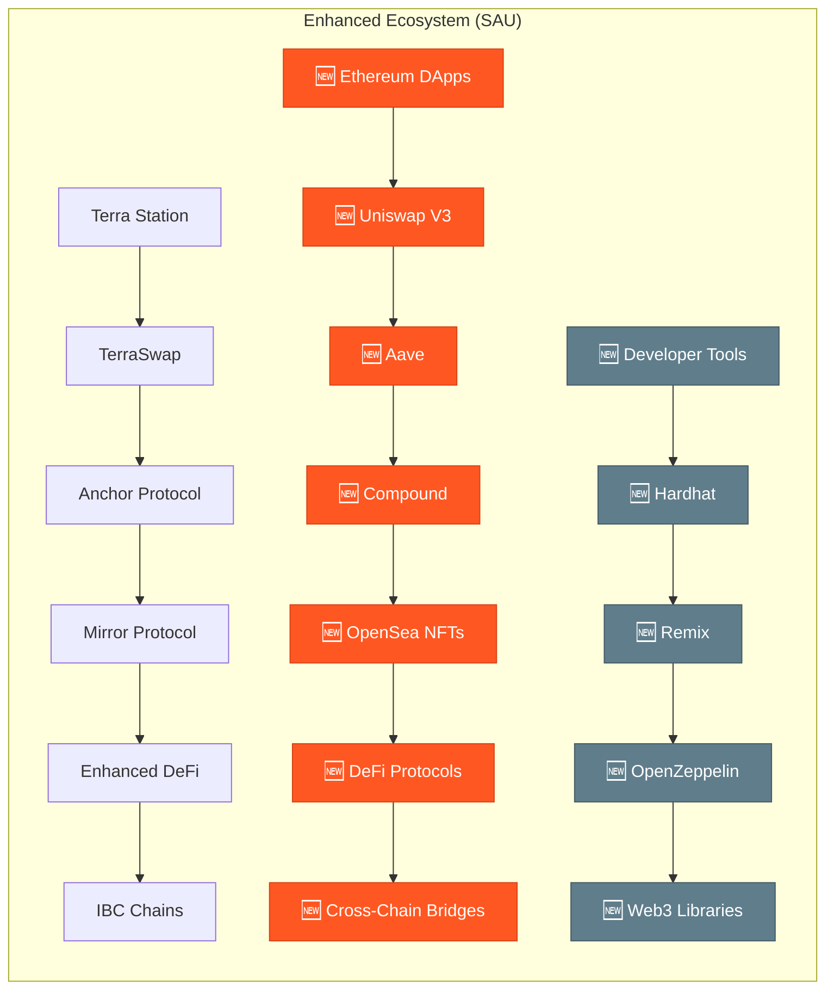

## 7. Security Comparison

#### 7.1 Security Model (TRƯỚC)

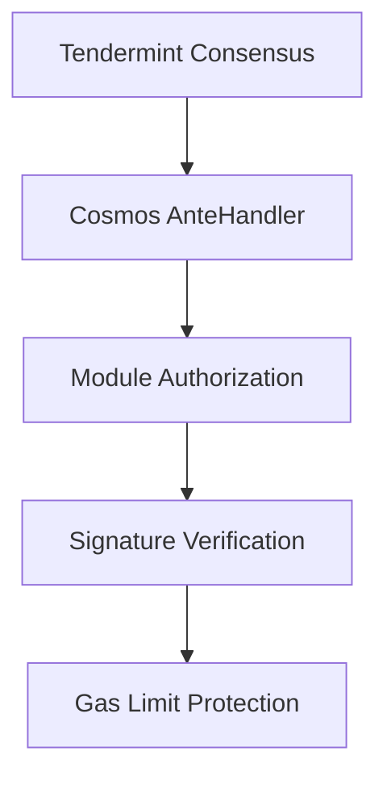

#### 7.1 Security Model (SAU)

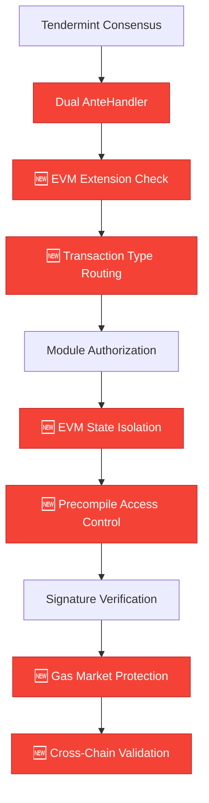

## 8. Migration Benefits Summary

| Khía Cạnh | Trước | Sau | Lợi Ích |
|-----------|-------|-----|---------|
| **Smart Contracts** | ❌ Chỉ CosmWasm | ✅ CosmWasm + Solidity | Tương thích Ethereum ecosystem |
| **Wallet Support** | 🔵 Terra Station, Keplr | 🔵 Terra Station, Keplr + 🆕 MetaMask | Tiếp cận người dùng Ethereum |
| **DApps** | 🔵 Limited Terra DApps | 🔵 Terra DApps + 🆕 Ethereum DApps | Hàng nghìn DApps có sẵn |
| **Developer Tools** | 🔵 Go, Rust | 🔵 Go, Rust + 🆕 Solidity, JS | Cộng đồng developer lớn hơn |
| **Liquidity** | 🔵 Terra native assets | 🔵 Terra assets + 🆕 ERC20 tokens | Tăng thanh khoản đáng kể |
| **Gas System** | 🔵 Fixed pricing | 🔵 Fixed + 🆕 EIP-1559 dynamic | Tối ưu chi phí giao dịch |
| **Interoperability** | 🔵 IBC only | 🔵 IBC + 🆕 Ethereum bridges | Kết nối đa hệ sinh thái |

## 9. Implementation Timeline

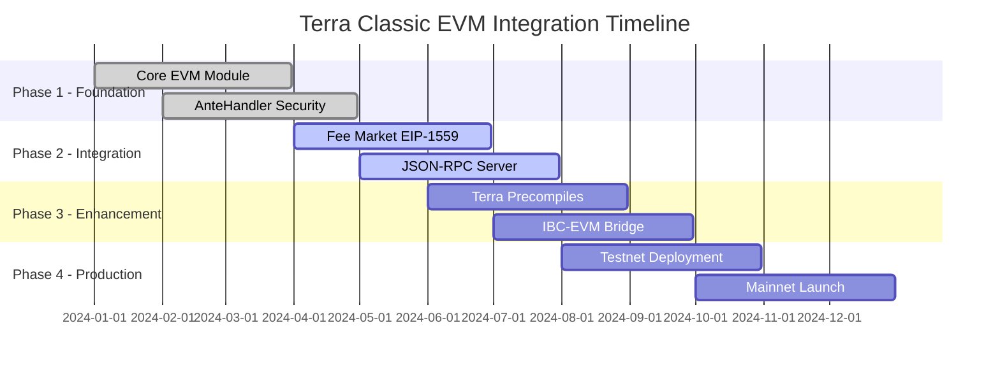

## Kết Luận

Việc tích hợp EVM vào Terra Classic mang lại:

### ✅ **Lợi Ích Chính**
- **Tương thích ngược 100%**: Tất cả tính năng Terra Classic hiện tại được bảo toàn
- **Mở rộng hệ sinh thái**: Tiếp cận hàng nghìn DApps Ethereum
- **Tăng thanh khoản**: ERC20 tokens và DEX protocols
- **Trải nghiệm người dùng**: MetaMask và các wallet phổ biến
- **Cộng đồng developer**: Solidity và Ethereum tooling

### 🔄 **Hybrid Architecture**
- **Dual Transaction Support**: Cosmos SDK + EVM transactions
- **Unified Security**: Single consensus với dual validation
- **Cross-Platform Access**: Terra modules accessible from Solidity
- **Optimized Performance**: EIP-1559 gas market + Terra efficiency

### 🚀 **Strategic Impact**
- **Market Position**: Trở thành bridge giữa Cosmos và Ethereum
- **Developer Adoption**: Thu hút developers từ cả hai ecosystems
- **User Growth**: Mở rộng user base từ cộng đồng Ethereum
- **Innovation Platform**: Foundation cho DeFi và NFT innovations

---

*Document này là phần của dự án Terra Classic EVM Integration. Cập nhật cuối: 2025-08-11*
