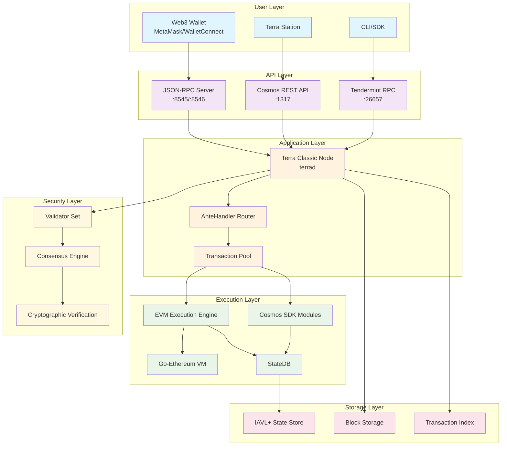
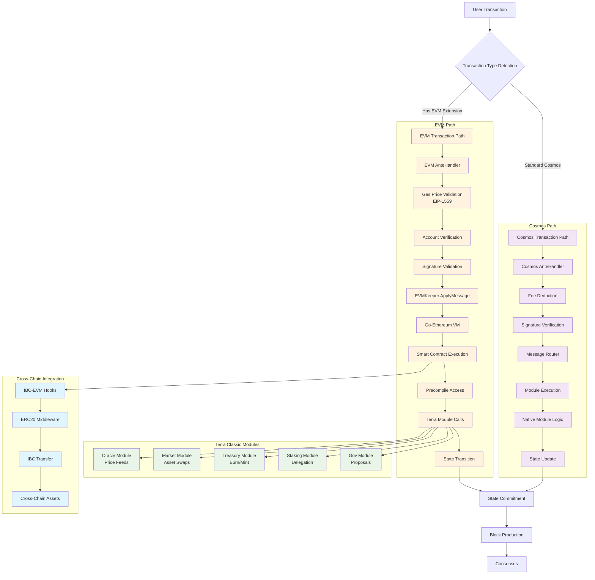
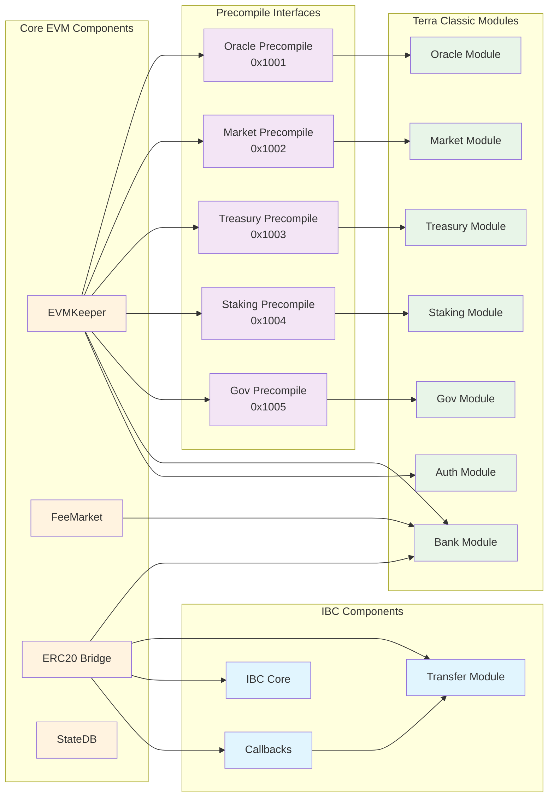

# Terra Classic EVM Integration - System Architecture Diagram

## Overview
This document provides visual representations of the Terra Classic EVM integration architecture, showing the flow of transactions, module interactions, and security implementations.

## Architecture Diagrams

### 1. High-Level System Architecture

### 2. Transaction Flow Architecture

### 3. Security Model & Attack Prevention

```mermaid
graph TB
    subgraph "Security Layers"
        A[Network Layer Security]
        B[Application Layer Security]
        C[Execution Layer Security]
        D[State Layer Security]
    end

    subgraph "Network Security"
        A --> E[Rate Limiting<br/>100 req/min/IP]
        A --> F[CORS Protection<br/>Localhost Only]
        A --> G[TLS Encryption<br/>HTTPS/WSS]
    end

    subgraph "Application Security"
        B --> H[AnteHandler Validation]
        B --> I[Gas Limit Enforcement]
        B --> J[Fee Market Protection]
        H --> K[AuthZ Bypass Prevention]
        H --> L[Extension Validation]
        H --> M[Signature Verification]
    end

    subgraph "Execution Security"
        C --> N[VM Isolation]
        C --> O[Precompile Access Control]
        C --> P[Gas Metering]
        N --> Q[State Snapshots]
        N --> R[Revert on Error]
        O --> S[Module Permission Checks]
    end

    subgraph "State Security"
        D --> T[IAVL+ Merkle Proofs]
        D --> U[Atomic Transactions]
        D --> V[Consensus Validation]
        T --> W[State Root Verification]
        U --> X[All-or-Nothing Updates]
    end

    subgraph "Threat Mitigation"
        Y[DoS Attack Prevention]
        Z[Smart Contract Exploits]
        AA[Cross-Chain Attacks]
        BB[Economic Attacks]
    end

    E --> Y
    I --> Y
    P --> Y
    
    N --> Z
    S --> Z
    
    L --> AA
    CC --> AA
    
    J --> BB
    DD --> BB

    %% Styling
    classDef security fill:#ffebee
    classDef mitigation fill:#e8f5e8
    
    class A,B,C,D security
    class Y,Z,AA,BB mitigation
```

### 4. Module Integration Map

## Component Details

### EVMKeeper Configuration
- **Go-Ethereum Version**: v1.13.5+
- **EVM Version**: London (EIP-1559 support)
- **Gas Limit**: 50M per block
- **Precompile Range**: 0x1001-0x1FFF (Terra specific)

### Fee Market Parameters
- **Base Fee**: 25 gwei initial
- **Elasticity Multiplier**: 2x
- **Adjustment Rate**: 12.5% per block
- **Min Gas Price**: 12.5 gwei floor

### Security Configurations
- **Rate Limiting**: 100 requests/minute/IP
- **Gas Cap**: 50M gas per call
- **Timeout**: 5s EVM execution
- **Batch Limit**: 100 requests per batch

### IBC Integration
- **Callback Gas**: 1M gas limit
- **ERC20 Conversion**: Automatic
- **Channel Binding**: ICS-20 compatible
- **Cross-chain Assets**: Full support

## Implementation Status

| Component | Status | Dependencies | Security Review |
|-----------|--------|--------------|-----------------|
| EVMKeeper | ✅ Ready | cosmos-sdk v0.47 | ✅ Complete |
| AnteHandler | ✅ Ready | EVMKeeper | ✅ Complete |
| FeeMarket | ✅ Ready | Bank Module | ✅ Complete |
| JSON-RPC | ✅ Ready | EVMKeeper | ✅ Complete |
| Precompiles | 🟡 In Progress | Terra Modules | 🟡 Pending |
| IBC-EVM | 🟡 In Progress | IBC Core | 🟡 Pending |

## Next Steps

1. **Precompile Development**: Complete Terra-specific precompile implementations
2. **Integration Testing**: Full end-to-end testing with Terra Classic testnet
3. **Security Audit**: Third-party security review of all components
4. **Governance Proposal**: Community vote for mainnet activation
5. **Phased Rollout**: Gradual activation with monitoring

---

*This document is part of the Terra Classic EVM Integration project. Last updated: 2025-08-11*
