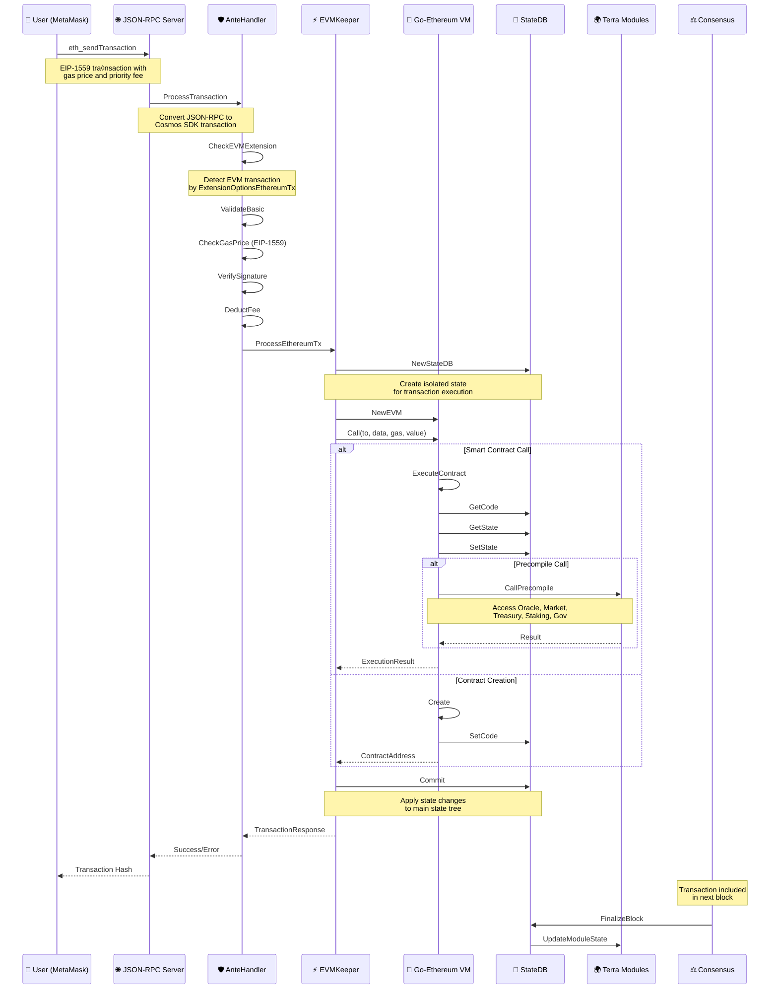
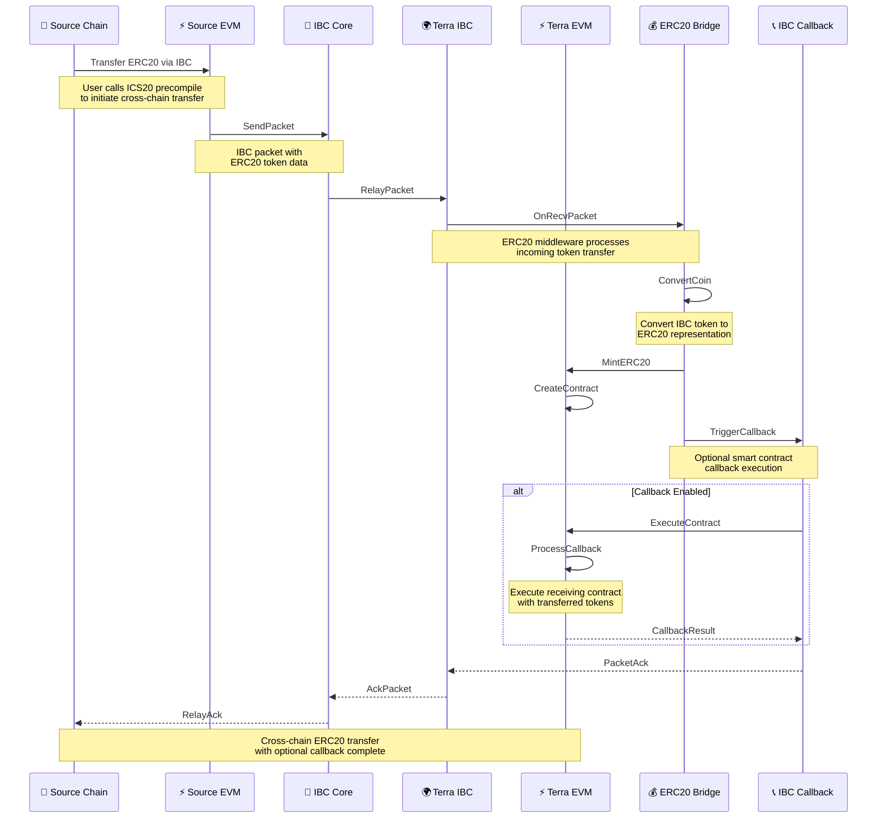
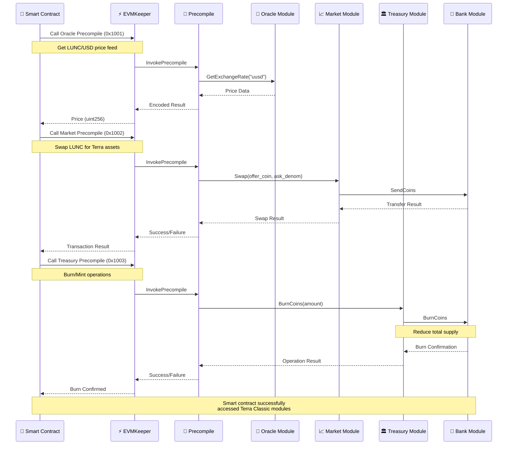
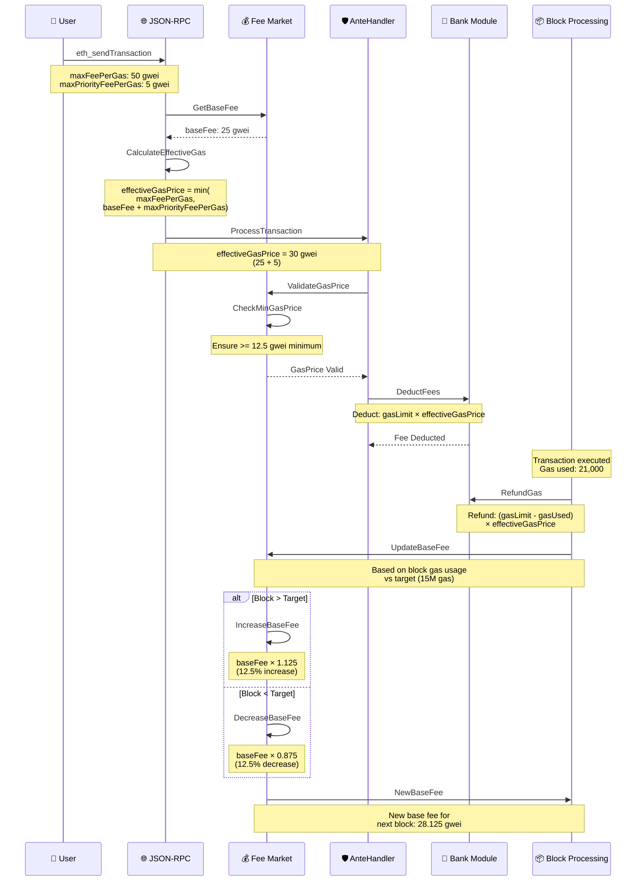
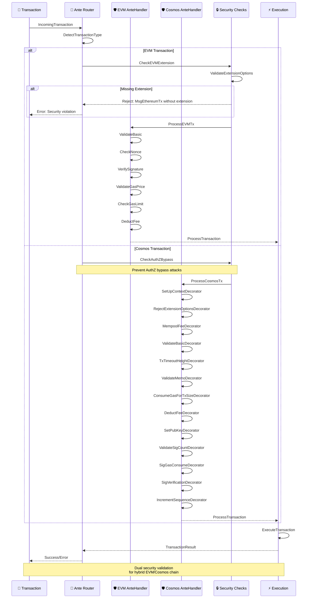

# Terra Classic EVM Integration - Transaction Flow Sequence Diagrams

## Overview
This document provides detailed sequence diagrams showing how different types of transactions flow through the Terra Classic EVM integration system.

## Sequence Diagrams

### 1. EVM Transaction Flow (Smart Contract Call)

### 2. Cross-Chain IBC-EVM Transaction Flow

### 3. Terra Native Module Access via Precompiles

### 4. Fee Market (EIP-1559) Processing

### 5. AnteHandler Security Flow

## Transaction Types Summary

### EVM Transactions
- **Type**: `MsgEthereumTx` with `ExtensionOptionsEthereumTx`
- **Gas**: EIP-1559 pricing (base fee + priority fee)
- **Signature**: ECDSA secp256k1 (Ethereum format)
- **Data**: Contract calls, deployments, transfers
- **Routing**: EVM AnteHandler → EVMKeeper → Go-Ethereum VM

### Cosmos Transactions
- **Type**: Standard Cosmos SDK messages
- **Gas**: Fixed gas prices in LUNC
- **Signature**: ECDSA secp256k1 (Cosmos format)
- **Data**: Bank transfers, staking, governance, IBC
- **Routing**: Cosmos AnteHandler → Message Router → Module

### Cross-Chain Transactions
- **Type**: IBC packets with EVM callbacks
- **Processing**: IBC Core → ERC20 Middleware → Callback execution
- **Assets**: Automatic ERC20 representation of IBC tokens
- **Security**: Gas-limited callback execution (1M gas max)

## Security Checkpoints

1. **Transaction Type Detection**: Prevent mixing EVM/Cosmos transaction types
2. **Extension Validation**: Ensure EVM transactions have proper extensions
3. **AuthZ Bypass Prevention**: Block unauthorized privilege escalation
4. **Gas Limit Enforcement**: Prevent DoS attacks through resource exhaustion
5. **Signature Verification**: Validate cryptographic signatures for both formats
6. **Fee Market Protection**: Ensure adequate fees to prevent spam
7. **State Isolation**: Isolate EVM execution from Cosmos state until commit
8. **Precompile Access Control**: Validate permissions for Terra module access

---

*This document is part of the Terra Classic EVM Integration project. Last updated: 2025-08-11*
